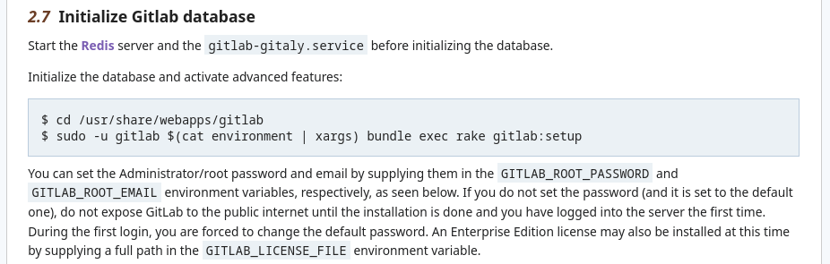

由 Wiki 2.7部分:


命令：
```shell
sudo -u gitlab $(cat environment | xargs) bundle exec rake gitlab:setup 
```
按照 Wiki 正常流程可能报错：
```shell
You can add prime to your Gemfile or gemspec to silence this warning.
Also please contact the author of fast_gettext-2.3.0 to request adding prime into its gemspec.
rake aborted!
NameError: uninitialized constant RSpec
/usr/share/webapps/gitlab/lib/tasks/benchmark.rake:7:in `block in <main>'
/usr/share/webapps/gitlab/lib/tasks/benchmark.rake:5:in `<main>'
/usr/share/webapps/gitlab/vendor/bundle/ruby/3.3.0/gems/railties-7.0.8.7/lib/rails/engine.rb:661:in `load'
/usr/share/webapps/gitlab/vendor/bundle/ruby/3.3.0/gems/railties-7.0.8.7/lib/rails/engine.rb:661:in `block in run_tasks_blocks'
/usr/share/webapps/gitlab/vendor/bundle/ruby/3.3.0/gems/railties-7.0.8.7/lib/rails/engine.rb:661:in `each'
/usr/share/webapps/gitlab/vendor/bundle/ruby/3.3.0/gems/railties-7.0.8.7/lib/rails/engine.rb:661:in `run_tasks_blocks'
/usr/share/webapps/gitlab/vendor/bundle/ruby/3.3.0/gems/railties-7.0.8.7/lib/rails/application.rb:501:in `run_tasks_blocks'
/usr/share/webapps/gitlab/vendor/bundle/ruby/3.3.0/gems/railties-7.0.8.7/lib/rails/engine.rb:464:in `load_tasks'
/usr/share/webapps/gitlab/vendor/bundle/ruby/3.3.0/gems/railties-7.0.8.7/lib/rails/railtie.rb:226:in `public_send'
/usr/share/webapps/gitlab/vendor/bundle/ruby/3.3.0/gems/railties-7.0.8.7/lib/rails/railtie.rb:226:in `method_missing'
/usr/share/webapps/gitlab/Rakefile:18:in `<top (required)>'
/usr/share/webapps/gitlab/vendor/bundle/ruby/3.3.0/gems/rake-13.0.6/exe/rake:27:in `<top (required)>'
/usr/bin/bundle:25:in `load'
/usr/bin/bundle:25:in `<main>'
(See full trace by running task with --trace)
```
这个错误可能和 benchmark.rake 文件有关。
```shell
sudo -u gitlab $(cat environment | xargs) SKIP_POST_DEPLOYMENT_MIGRATIONS=true bundle exec rake gitlab:setup RAILS_ENV=production
```

- 添加 RAILS_ENV=production 明确指定环境
- 添加 SKIP_POST_DEPLOYMENT_MIGRATIONS=true 来跳过一些可能导致问题的迁

```shell
sudo -u gitlab $(cat environment | xargs) bundle exec rake gitlab:env:info
```

```shell
sudo -u gitlab $(cat environment | xargs) SKIP_POST_DEPLOYMENT_MIGRATIONS=true bundle exec rake gitlab:env:info RAILS_ENV=production
```
