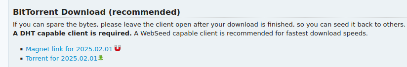
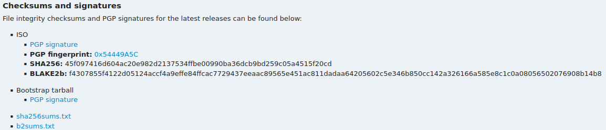

## 前戏
`archlinux-2023.08.01-x86_64.iso`通过工具烧录到U盘中，U盘就有了系统。
插入U盘到主板，计算机找到U盘系统后启动，加载U盘的Linux操作系统到内存中，U盘里的算是小型系统。
我们将完整的Linux内核、Linux硬件驱动、应用程序安装到目标硬盘中做永存，待下次主板上电时，BIOS能检测到系统盘，通过设置其优先启动，之后的每一次启动电脑就会默认加载其系统。

提前准备：
- 镜像文件 `archlinux-2023.08.01-x86_64.iso`
- U盘 **>16G**
- 联网

ArchLinux 版本根据实际调整，此处用的是`2023.08.01`版本。

## 镜像文件下载

文件长这样：`archlinux-2023.08.01-x86_64.iso`， 版本灵活应变。
[进入下载页面](https://archlinux.org/download/)。

- 方法一（速度更快）：有BitTorrent下载器（例如：qbittorrent)，找到这样的链接来下载。
  
- 方法二：往下翻找到您的国家，比如China，
  选一个`https`协议的下载链接进行下载.后缀名一个.iso,一个.iso.sig 两个都要下载。

### 确认资源安全

计算机中，每个文件都可以通过一些算法（MD5,SHA256,BLAKE2b）算出唯一的Hash值，一旦文件受到更改，得出的Hash就不一样。
Hash同资源一起发布，以供用户检测文件是否被篡改。所以要用https，不要用http，下载完后的文件记得检测。在下载界面找到：

以上包括ISO和Bootstrap tarball，找到ISO部分，点`PGP signature`链接下载。
最好`.iso`和`.iso.sig`，也就是资源和checksums或者signatures在同一目录下，方便命令操作，待检测通过后便可删除所有验证文件。
以下3种方法，检测iso，`<version>` 替换成你实际文件版本：

- GPG signature
  ```shell
  gpg --auto-key-locate clear,wkd -v --locate-external-key pierre@archlinux.org
  gpg --keyserver-options auto-key-retrieve --verify archlinux-<version>-x86_64.iso.sig archlinux-<version>-x86_64.iso
  ```
  成功提示：
  ```shell
  gpg: assuming signed data in 'archlinux-2025.02.01-x86_64.iso'
  gpg: Signature made Sat Feb  1 16:31:26 2025 CST
  gpg:                using EDDSA key 3E80CA1A8B89F69CBA57D98A76A5EF9054449A5C
  gpg:                issuer "pierre@archlinux.org"
  gpg: Good signature from "Pierre Schmitz <pierre@archlinux.org>" [unknown]
  gpg:                 aka "Pierre Schmitz <pierre@archlinux.de>" [unknown]
  gpg: WARNING: The key's User ID is not certified with a trusted signature!
  gpg:          There is no indication that the signature belongs to the owner.
  Primary key fingerprint: 3E80 CA1A 8B89 F69C BA57  D98A 76A5 EF90 5444 9A5C
  ```
  验证通过，WARNING是不知道KEY的拥有者正不正确，不是文件资源问题，Pierre Schmitz就是ArchLinux的发布者。
- 已有的 ArchLinux 系统中执行
  ```bash
  pacman-key -v archlinux-<version>-x86_64.iso.sig
  ```
- BLAKE2b：还可以用checksums，找到b2sums.txt，下载到本地，里面包括bootstrap的内容（不用可删）
  ```shell
  b2sum -c b2sums.txt  # 成功提示 archlinux-2025.02.01-x86_64.iso: OK
  ```

## 系统U盘制作与使用

根据情况选择使用 rufus/dd 工具，**谨慎**设置盘符和镜像文件。

```shell
dd if=archlinux-2023.08.01-x86_64.iso of=/dev/sda bs=4096   #使用dd工具
```

### 进入U盘

重启计算机，在开机过程中抓紧按 **F2/F12/DEL**（根据主板型号） 键进入BIOS，可以设置启动顺序，
U盘最先，也可以使用**覆盖启动**U盘。BIOS设置后，进入U盘的GRUB，选择 ArchLinux Install 字样并回车，
系统加载，直接到zsh命令行。

### 选择包管理器镜像源

此为易忽略的步骤，在archinstall里的mirrorlist会同步到最终安装的系统中。

```bash
reflector -p https -c china > /etc/pacman.d/mirrorlist
```

### UEFI or Legacy

判断是否为 UEFI 启动, 在目录 `/sys/firmware/efi/efivars` 下有文件则是 UEFI,
没文件则是 Legacy BIOS.目前大多数 PC 都是 UEFI 模式，所有步骤主要针对 UEFI 平台安装

```bash
ls /sys/firmware/efi/efivars
```

## 磁盘分区格式化

此步骤较灵活，最小需要的分区仅仅只有启动盘**EFI分区**和系统盘**根分区**，有这两个分区就能实现系统安装。比较专业的场景不止会有**swap分区**和**home分区**，还会有**usr分区**,**var分区**等，根据场景而变化。

### 磁盘情况

`/dev`目录用于存放系统所能识别的所有设备，设备以文件名标识，每个文件代表不同的设备。比如：`/dev/sda1` 是Linux扫描到的第一块硬盘里的第一个分区。清晰自己的磁盘哪个分区放着哪些东西,
命令行参数根据自己的情况进行修改
```bash
lsblk # 列出所有磁盘
```
利用 `cfdisk` 工具,打开既有手册，**谨慎**分区硬盘,建议分区布局：

| 名称    | 类型                     | 假想设备路径              | 挂载点    | 推荐空间 |
|-------|------------------------|---------------------|--------|------|
| 启动盘   | BIOS boot 或 EFI System | /dev/sda1（据情况改）     | /boot  | 1G   |
| 内存交换盘 | Linux swap             | /dev/sda2 （据情况改）    | [SWAP] | 5G   |
| 系统盘   | Linux filesystem       | /dev/sda3   （据情况改）  | /      | 100G |
| 用户盘   | Linux filesystem       | /dev/sda4    （据情况改） | /home  | 200G |

#### 注意

- `cfdisk` 工具操作磁盘, 磁盘文件"/dev/sda"根据自己的情况进行修改，实际上挂载点是灵活的,只要保证其他分区挂载点在根目录内都可
- 启动1G左右，增加系统容错率。启动盘是根基，若容量过小， 随着系统数量增加，可能会导致启动异常，极难恢复。
- 内存交换盘用于虚拟内存，待机休眠。是个可选项，在服务器里是必备的。
- 系统盘类似于 Windows 的C盘，数据量随着系统使用时长增加而增加，软件/配置/Docker镜像等默认安装在此。
- 用户盘通常存放系统普通使用者的数据，可选项，为分担系统盘存储压力以及方便移植从而独立出来。

```bash
cfdisk /dev/sda
# 或者（据情况改）
cfdisk /dev/nvme0n1
```

### 挂接硬盘

```bash
mkfs.fat -F 32 /dev/sda1 #选择你的启动盘（efi分区） BIOS模式启动也要这个分区，但不格式化
mkswap /dev/sda2 #选择你的内存交换盘（swap分区）
swapon /dev/sda2 #选择你的内存交换盘（swap分区）
mkfs.ext4 /dev/sda3  #选择你的系统盘（根分区）
mkfs.ext4 /dev/sda4  #选择你的用户盘（home分区）
mount /dev/sda3 /mnt  #挂载根分区，系统安装到此
mount --mkdir /dev/sda1 /mnt/boot #挂载EFI分区，grub安装到此
mount --mkdir /dev/sda4 /mnt/home #挂载HOME分区，独立出普通用户家目录
```

## 网络配置

如有网线且有网，可以接入计算机并[跳过网络配置](#网络测试)。
此时硬盘已经配置完毕，接下来把系统安装到硬盘中。ArchLinux 镜像文件中不包含任何软件包，
所以需借助网络下载软件包。

### wifi连接

常用于笔记本电脑安装。

```bash
iwctl #进入联网工具 iwctl
device list #查看网卡
station wlan0 scan #扫描 wifi
station device get-networks #扫描结果
station device connect <SSID> #连接相应 wifi SSID 为 wifi 名
exit #或者 Ctrl + d
```

### 网络测试

```bash
ping archlinux.org  # 检测是否联网，有正确返回信息则成功
date  # 显示当前时间
timedatectl set-ntp true  # 如果时间不正确,请时间矫正
```

## 安装系统包

将ArchLinux系统以及驱动通过`/mnt`挂载点下载安装到硬盘中

```bash
pacstrap /mnt base linux linux-firmware
```

## 系统配置

安装完系统后，还需要配置系统的自动挂载盘、时区、语言、键盘布局、用户、主机名。

```bash
genfstab -U /mnt >> /mnt/etc/fstab  # 配置启动时自动挂载主分区
arch-chroot /mnt  # 切换根分区
```

_此时，执行完 arch-chroot 后，切换到新的系统中去，相当于从U盘系统切换到硬盘系统，
U盘系统的作用基本上到此为止

## 安装应用软件

```bash
pacman -S bash-completion # 先安装补全，利用补全高效输入命令
pacman -S base-devel grub efibootmgr os-prober networkmanager unrar\
  bash-completion nano vim git firefox chromium man-pages ntfs-3g \
```

## 启用网络

```shell
sudo systemctl enable --now NetworkManager    
```

## 生成系统语言
对 `en_US.UTF-8` 一行取消注释`vim /etc/locale.gen`
```bash
locale-gen
```

## 系统必要配置

1. 配置系统语言
2. 主机名设为 'testhostname',可自行命名
3. 设置 root 密码
4. 创建用户，设置用户密码
5. sudo 授权.
6. 设置时区 Region/City 可替换为 Asia/Shanghai
7. 一些软件需要用到 LANG 环境变量,设置为 en_US.UTF-8
```bash
echo 'LANG=en_US.UTF-8' > /etc/locale.conf
echo 'testhostname' > /etc/hostname
passwd
useradd -m testuser -G wheel && passwd testuser 
vim /etc/sudoers  # 为 testuser 开启 sudo 权限, 根据文件里的提示，取消 wheel的注释
ln -sf /usr/share/zoneinfo/Region/City /etc/localtime
mkinitcpio -P
```

## 安装 grub,引导程序

```bash
grub-install --target=x86_64-efi --efi-directory=/boot --bootloader-id=GRUB
```

如果你需要双系统,请 os-prober 自动扫描双系统。允许 grub 检测系统. true 改为 false,并取消注释`vim /etc/default/grub`

```bash
...
GRUB_DISABLE_OS_PROBER=false
...
```
保存配置，返回archinstall，在执行`grub-mkconfig -o /boot/grub/grub.cfg`后，os-prober会探索磁盘上的所有系统，载入启动项。
```bash
grub-mkconfig -o /boot/grub/grub.cfg  # 生成 grub 配置文件
exit  # 退出硬盘系统至 iso 安装系统，或者Ctrl+d
```
关机后弹出U盘
```shell
shutdown now
```
再次启动时进入bios/boot里将刚才安装的ArchLinux Grub设置最优先，保存bios设置并退出重启。
