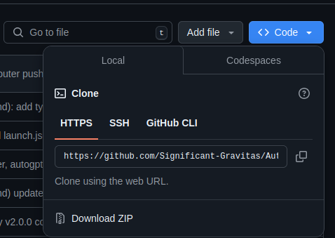

Git是分布式版本控制工具，不仅能与中央服务器交互代码，还能在本地提交。如今都用git开发软件，这样能很好的管理项目代码。Github是微软运营的代码托管平台，全世界开源代码几乎都在这上面，提交代码，讨论issue。GitLab也是代码托管平台，还能在服务器上自行部署，搭建自己的git服务器，常用于企业或个人代码仓库管理。

## 克隆仓库

从远端代码托管服务器中（Github）复制仓库到本地，不单单克隆代码，还包括项目提交日志。常用https和ssh协议下载。


https可以直接下载，对于ssh则需要配置ssh-key，把公钥密码上传至Github，在使用时，添加私钥即可。

```shell
git clone https://github.com/Significant-Gravitas/AutoGPT.git # https
git clone git@github.com:Significant-Gravitas/AutoGPT.git # ssh
```

### main 还是 master

公认的主分支范式到底是main还是master？git工具自身使用的是master, 而github又使用main.同时使用git和github,
一不注意就会又两个主分支.因为master在西方文化中含有种族歧视的意义, 所以github平台更改了他们的主分支名称.master ->
main. 这就是为什么以前的github用master, 而现在用main. 我开始全部用main作主分支.

## 拉取代码

当远端代码出现了新版本，本地仓库需要同步远端代码，
> 拉下前，本地的提交日志需要和远端的提交日志一致，如果不一致，比如自己改了代码并提交了（commit），则可能会引起冲突，操作不当可能会覆盖自己的修改。

```bash
git pull origin master:brantest #将远程主机 origin 的 master 分支拉取过来，与本地的 brantest 分支合并
```

### 遇到的问题

- 示例：在Github上用网站自带的提交功能手动添加了新文件并提交，再在本地推送（push）项目至远端。
- 期望：提示已是最新版本`everything is up-to-date`。
- 结果：
    ```bash
    error: failed to push some refs to 'github.com:xxx/xxx.git'
    hint: Updates were rejected because the remote contains work that you do not
    hint: have locally. This is usually caused by another repository pushing to
    hint: the same ref. If you want to integrate the remote changes, use
    hint: 'git pull' before pushing again.
    ```

注意核对两边的commit ID. 这个问题就是github上有更新的版本, 本地是旧版本，不再允许你push,所以先pull

## 本地操作

在项目根文件夹下,新建仓库.敲完后项目文件夹产生一个`.git`文件夹.先赐予当前目录版本控制系统

```bash
git init  # 会新建一个 .git/ 目录
git init --initial-branch=main  # 同上, 并且设定初始分支名称(推荐)
```

觉得代码写的有一定数量了，将项目里的所有文件(-A)添加到暂存区(stage).

```bash
git add -A  # 将修改代码提交到暂存区
git add .  # 同上, 这个更常用
```

代码完成，功能测试完毕。接下来提交暂存区里的内容到仓库(repo)他会打开系统默认文本编辑器,根据提示写下更新注释,保存退出.如果环境变量
EDITOR=vim,他就打开 vim.

```bash
git commit # 将暂存区提交
git commit -m 'message' # 同上, 或者直接提交更新注释'message'
```

## 查看信息

公钥放在 Github 上,私钥留在自己电脑里只有自己知道

```bash
git status  # 在需要了解项目状态时, 可以用到, 比如add了哪些,还有没有修改了没有add的等等.
git log # 查看提交日志, 历史提交记录
```

## 代码分支

```bash
git branch feature  # 创建新的分支feature
git branch -M main  # 修改当前分支名为main
git branch -u origin/main  # 切换远端默认分支
```

## 同步远程

不推荐使用https，不够稳定。使用 ssh 私钥，配置密钥对,根据提示生成密钥对存放在指定位置（默认在~/.ssh 下）, `.pub`
是公钥文件,需传输到服务端。在Github设置中编辑个人信息，侧面找到`SSH KEY`字样，进入添加SSH界面，将公钥复制到Github中保存。

```bash
ssh-keygen -t ed25519 -C "<your_email>@example.com" # 使用ed25519加密算法生成密钥对
```

上传添加完公钥后,就可以使用不对称加密协议密钥. 启动一个ssh-agent, 再载入私钥文件. 如果私钥文件设置了密码, 输入正确的密钥即可。

```bash
eval $(ssh-agent) 
ssh-add /home/ceelia/.ssh/id_ed25519  # 在当前终端添加私钥文件，以使用私钥交互
```

添加远端地址（origin），命名为origin，也可以添加多个远端地址，设置不同的名字。远端地址写您实际git项目仓库地址。添加一个默认的Github远端仓库。origin代表默认远端地址，默认就是在使用时不用指定远端名字：`git push`=`git push origin`。

```bash
git remote add origin git@github.com:xxx/xxx.git  # 
```

推送远端Git服务器,一下是几种方法,按情况选择:

```bash
git push --set-upstream origin  # 将本地的默认分支推送到远端origin同名分支
git push --set-upstream origin main:dev # 将本地的main分支推送到远端origin的dev分支
git push -u origin main:dev # 更新分支. 将本地的main分支推送到远端origin的dev分支
```

## 部署 Git Server

如果要部署Git Server，最好选择部署GitLab，不过此方法可以在比较低能的机器上搭建一个简易的 Git Server，原理很像
FTP/SCP。有能力的机器推荐使用 GitLab。

### 守护进程

搭建私域代码仓库，需要服务器最好是有公网，能异地提交代码。我的偏好是再新建一个`git`用户，此用户用来在服务器上专门管理代码仓库。

写一个守护进程服务，创建文件 `/etc/systemd/system/git-daemon.service`，模板如下

```
[Unit]
Description=Start Git Daemon

[Service]
ExecStart=/use/bin/git daemon --reuseaddr --base-path=/srv/git/ /srv/git/
Restart=always
RestartSec=500ms

StandardOutput=syslog
StandardError=syslog
SyslogIdentifier=git-daemon

User=git
Group=git

[Install]
WantedBy=multi-user.target
```

启动`git-daemon.service`

### 代码存储

将现有的代码克隆出一个bare版本

```bash
git clone --bare <repo> <repo.git>  # <repo>是仓库文件夹，克隆出bare版本到"仓库.git"
```

再将bare版本的文件夹上传到服务器上的`/srv/git`目录下，注意目录权限。因为git用的也是ssh协议，所以可以像用ssh一样使用git

```bash
git clone ssh://git@<IP>:<PORT>/srv/git/<repo.git>
```

若ssh使用的是标准的22端口，那么可以简写

```bash
git clone git@<IP>:/srv/git/<repo.git>
```

设置远端地址以及推送方式大致一样
