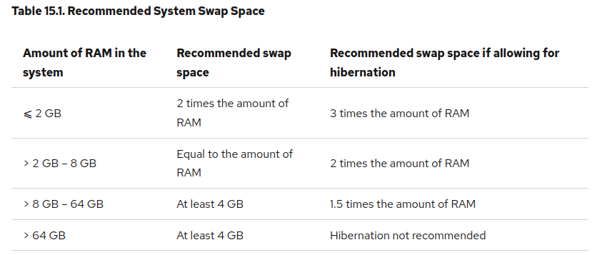
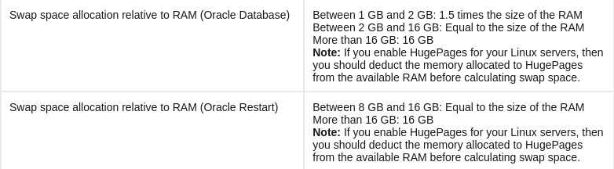

维基百科的解释，Wikipedia - Unix and Unix-like systems：
在Unix及类Unix系统中，当内存（RAM）占满时，系统把磁盘空间拿去代替内存，有些系统会在硬盘上划一块专门的区块作为页面文件（代替内存空间）交换文件用，称为交换分区（swap
partitions），有些系统还可以把这个区块用文件的形式出现。用一整块磁盘作swap分区也是很常见的。

Linux.com的解释，All about Linux swap space:
Linux 将物理内存分为内存段，叫做页面。交换是指内存页面被复制到预先设定好的硬盘空间(叫做交换空间)
的过程，目的是释放这份内存页面。物理内存和交换空间的总大小是可用的虚拟内存的总量。

ArchWiki的解释:
交换空间可以是磁盘的一个分区，也可以是一个文件。用户可以在安装时或安装后的任何时候创建交换空间。交换空间有两种用途：第一，是将虚拟内存扩大到超过已安装的物理内存（RAM）的容量；第二，是用于
suspend-to-disk 支持。使用swap扩展您的虚拟内存是否有好处取决与您的物理内存。如果物理内存不足以支撑您日常使用全部的程序的话（体现在日常使用时内存满了导致的卡顿，死机），使用swap也许会对您有些帮助。这样可以避免
out of memory conditions，Linux内核OOM
Killer机制将尝试通过杀进程的方式来自动释放内存。如果您想让虚拟内存足够使用，请添加相应的差值（或更多）作为交换空间。启用交换的最大缺点是性能较低，因此，启用swap是个人喜好问题：当物理内存用完时，有些人更喜欢杀死程序而不是启用交换，而另一些人更喜欢启用交换和较慢的系统。

## 查询Swap

检查交换空间的状态用`swapon --show`，检查物理内存和交换空间情况用`free -h`，我4块8G内存总共32G，用的4G Swap磁盘空间一直占满，显然不够。

## 分配空间

根据红帽文档Red Hat Enterprise Linux Recommended System Swap Space：

| 系统内存大小         | 推荐Swap大小 | 带休眠推荐Swap大小 |
|----------------|----------|-------------|
| ⩽ 2 GB         | 2倍内存大小   | 3倍内存大小      |
| > 2 GB – 8 GB  | 同等内存大小   | 2倍内存大小      |
| > 8 GB – 64 GB | 最少4 GB   | 1.5倍内存大小    |
| > 64 GB        | 最少4 GB   | 不建议休眠       |

对于数据库安装条件，Oracle有推荐

| 系统内存大小       | 推荐Swap大小 |
|--------------|----------|
| 1 GB - 2 GB  | 1.5倍内存大小 |
| 2 GB - 16 GB | 同等内存大小   |
| > 16 GB      | 16 GB    |
